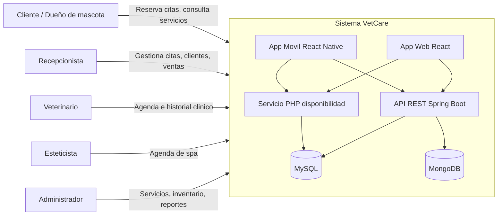
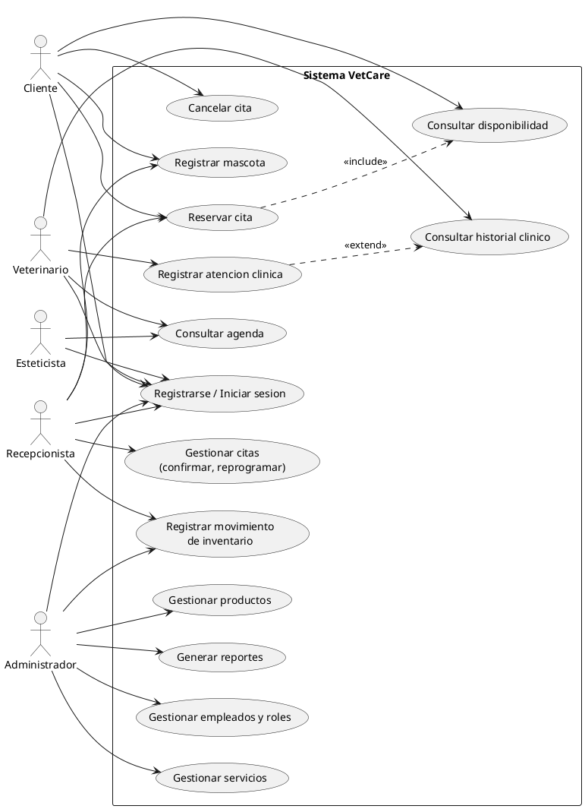
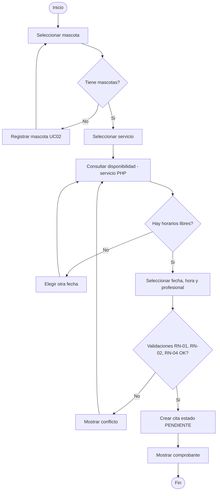
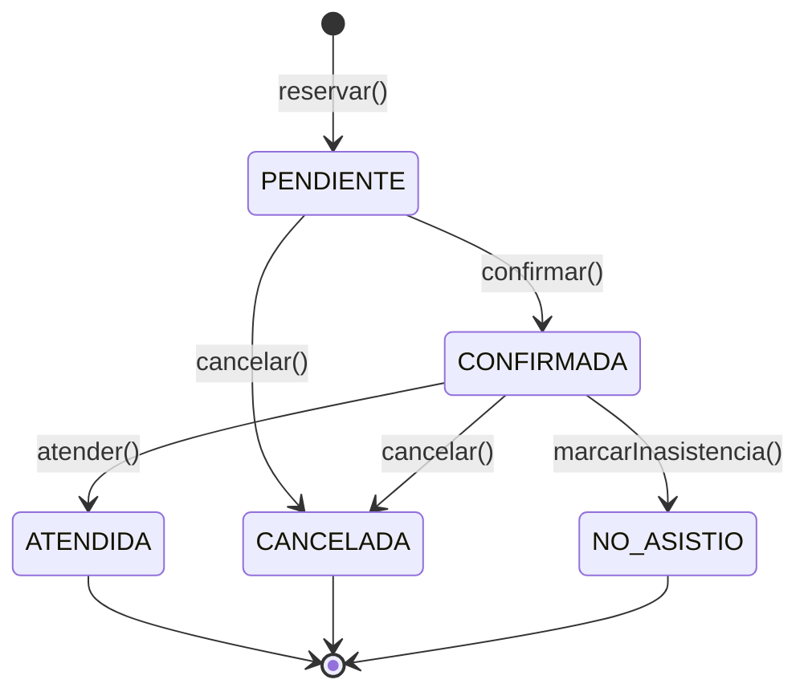
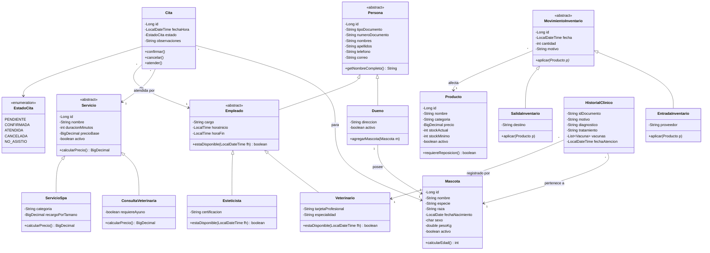
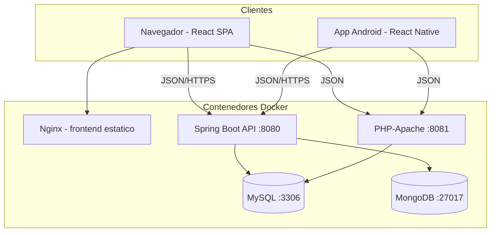

# FASE 1 — INGENIERÍA DE REQUISITOS Y PROPUESTA TÉCNICA
## Sistema de Gestión Integral "VetCare" — Veterinaria y Spa de Mascotas

**Programa:** Tecnología en Análisis y Desarrollo de Software (ADSO) — SENA
**Proyecto:** Evolución de sitio web estático a sistema de gestión web y móvil
**Fase:** 1 de N — Elicitación, análisis, especificación y propuesta técnica
**Fecha:** Agosto de 2026
**Versión del documento:** 1.0

> **Nota metodológica:** El nombre "VetCare" es un identificador de trabajo; debe
> reemplazarse por el nombre real de la veterinaria del código base.

---

## TABLA DE CONTENIDO

1. Elicitación de requisitos
2. Análisis y especificación de requisitos (SRS)
3. Diagramas de especificación y análisis
4. Modelo conceptual orientado a objetos
5. Validación de documentos de requisitos
6. Especificaciones de software
7. Propuesta técnica

---

# 1. ELICITACIÓN DE REQUISITOS

## 1.1 Objetivo de la elicitación

Identificar, capturar y documentar las necesidades reales de los interesados
(stakeholders) de la veterinaria, con el fin de transformar el sitio web
informativo existente en un sistema de gestión con reservas en línea,
administración interna e inventario básico.

## 1.2 Identificación de stakeholders

| ID | Stakeholder | Rol en el sistema | Interés principal |
|----|-------------|-------------------|-------------------|
| ST-01 | Administrador / propietario de la veterinaria | Usuario administrador | Control total: servicios, empleados, inventario, reportes |
| ST-02 | Recepcionista | Usuario operativo | Gestión de citas, registro de clientes y mascotas |
| ST-03 | Veterinario | Usuario profesional | Agenda propia, historial clínico de pacientes |
| ST-04 | Esteticista (spa) | Usuario operativo | Agenda de servicios de spa (baño, peluquería) |
| ST-05 | Dueño de mascota (cliente) | Usuario final externo | Reservar citas desde la web/móvil, ver sus mascotas |
| ST-06 | Instructores SENA | Evaluadores | Verificación de competencias técnicas del proyecto |

## 1.3 Técnicas de elicitación aplicadas

Se seleccionaron cuatro técnicas complementarias. Cada una se justifica según
el tipo de información que permite obtener:

**a) Entrevista semiestructurada (ST-01, ST-02, ST-03).**
Permite profundizar en los procesos internos del negocio (cómo se agenda hoy
una cita, cómo se controla el stock). Se elige el formato semiestructurado
porque combina preguntas preparadas con la flexibilidad de explorar respuestas
inesperadas.

**b) Observación directa del proceso actual.**
Se observa una jornada de atención: llegada del cliente, registro manual,
asignación de turno, venta de productos. Esta técnica revela requisitos
implícitos que los entrevistados no verbalizan (p. ej., el doble registro del
mismo cliente en cuadernos distintos).

**c) Análisis de artefactos existentes.**
El sitio web actual (HTML/CSS/JS) es un artefacto clave: sus secciones
(servicios, contacto, galería) representan requisitos ya validados por el
negocio y constituyen la base de la migración a React. También se analizan
los cuadernos de citas y las facturas de compra de insumos.

**d) Cuestionario a clientes (ST-05).**
Formulario corto (Google Forms) a una muestra de clientes para priorizar
funcionalidades de la app móvil: ¿prefieren reservar por teléfono o por app?,
¿qué servicios reservarían en línea?

## 1.4 Instrumento: guion de entrevista (extracto)

**Entrevista al administrador (ST-01):**

1. ¿Cómo se registra hoy una cita y qué problemas presenta ese proceso?
2. ¿Qué servicios ofrece la veterinaria y cuáles tienen mayor demanda?
3. ¿Cómo controla actualmente el inventario de productos e insumos?
4. ¿Qué información necesita ver en reportes para tomar decisiones?
5. ¿Qué debería poder hacer un cliente por sí mismo desde su celular?
6. ¿Quiénes deben tener acceso al sistema y con qué permisos?

**Entrevista al veterinario (ST-03):**

1. ¿Qué información clínica registra en cada consulta?
2. ¿Cómo consulta el historial de una mascota que ya ha sido atendida?
3. ¿Cómo organiza su agenda y qué conflictos de horario se presentan?

## 1.5 Hallazgos principales de la elicitación

| ID | Hallazgo | Requisito derivado |
|----|----------|--------------------|
| H-01 | Las citas se registran en cuaderno físico; hay cruces de horario | Módulo de citas con validación de disponibilidad |
| H-02 | No existe registro unificado de clientes y mascotas | Módulo de gestión de dueños y mascotas |
| H-03 | El stock se revisa "a ojo"; hay quiebres de inventario | Módulo de inventario con alertas de stock mínimo |
| H-04 | El historial clínico está en carpetas de papel | Historial clínico digital (candidato a MongoDB por su estructura variable) |
| H-05 | Los clientes llaman por teléfono para saber disponibilidad | Endpoint público de consulta de disponibilidad (servicio PHP) |
| H-06 | La web actual solo informa, no gestiona | Migración del frontend a React conectado a API REST |
| H-07 | Los clientes jóvenes prefieren agendar desde el celular | App móvil React Native para reservas |

---

# 2. ANÁLISIS Y ESPECIFICACIÓN DE REQUISITOS

Este apartado sigue la estructura recomendada por el estándar **IEEE 830 /
ISO/IEC/IEEE 29148** (Especificación de Requisitos de Software, SRS),
adaptada al alcance del proyecto formativo.

## 2.1 Descripción general del producto

El sistema **VetCare** es una solución compuesta por:

- **Aplicación web (React):** portal público (información, servicios,
  contacto — heredado del sitio actual) más panel de gestión interna
  (citas, clientes, mascotas, servicios, inventario, historial clínico).
- **API REST (Spring Boot):** backend central que expone la lógica de
  negocio y persiste en MySQL; historial clínico en MongoDB.
- **Servicio web PHP:** endpoint complementario de consulta de
  disponibilidad de citas, consumido por la web y la app móvil.
- **Aplicación móvil (React Native):** reservas de consulta veterinaria y
  spa, y manejo básico de inventario para el personal.

## 2.2 Alcance y exclusiones

**Incluye:** gestión de dueños, mascotas, empleados, servicios, citas,
inventario (productos y movimientos), historial clínico básico,
autenticación con roles.

**Excluye (fuera de alcance de esta versión):** facturación electrónica DIAN,
pasarela de pagos en línea, telemedicina, nómina. Estas exclusiones se
declaran explícitamente para acotar el proyecto a un nivel sustentable de
tecnólogo.

## 2.3 Requisitos funcionales

Convención de codificación: `RF-XX`. Prioridad: **A** (alta/esencial),
**M** (media), **B** (baja/deseable). La columna *Módulo* facilita la
trazabilidad hacia el diseño.

| Código | Nombre | Descripción | Prioridad | Módulo | Actor principal |
|--------|--------|-------------|-----------|--------|-----------------|
| RF-01 | Registrar dueño | El sistema debe permitir registrar un dueño con documento, nombres, teléfono, correo y dirección | A | Clientes | Recepcionista / Cliente |
| RF-02 | Registrar mascota | El sistema debe permitir asociar una o varias mascotas a un dueño (nombre, especie, raza, fecha de nacimiento, sexo, peso) | A | Clientes | Recepcionista / Cliente |
| RF-03 | Consultar y editar clientes y mascotas | El sistema debe permitir buscar, listar, actualizar y desactivar dueños y mascotas | A | Clientes | Recepcionista |
| RF-04 | Gestionar servicios | El sistema debe permitir crear, editar y desactivar servicios con nombre, tipo (consulta / spa), duración estimada y precio | A | Servicios | Administrador |
| RF-05 | Consultar disponibilidad | El sistema debe exponer la disponibilidad de horarios por servicio y fecha (endpoint público del servicio PHP) | A | Citas | Cliente |
| RF-06 | Reservar cita | El sistema debe permitir reservar una cita seleccionando mascota, servicio, fecha, hora y profesional, validando que el horario esté libre | A | Citas | Cliente / Recepcionista |
| RF-07 | Gestionar estados de cita | El sistema debe permitir cambiar el estado de una cita: PENDIENTE → CONFIRMADA → ATENDIDA, o CANCELADA / NO_ASISTIO | A | Citas | Recepcionista / Veterinario |
| RF-08 | Consultar agenda | El sistema debe mostrar al profesional su agenda diaria y semanal | A | Citas | Veterinario / Esteticista |
| RF-09 | Registrar atención clínica | El sistema debe permitir al veterinario registrar la atención de una consulta: motivo, diagnóstico, tratamiento, vacunas y observaciones (historial clínico) | A | Historial | Veterinario |
| RF-10 | Consultar historial clínico | El sistema debe mostrar el historial clínico completo de una mascota en orden cronológico | A | Historial | Veterinario |
| RF-11 | Gestionar productos | El sistema debe permitir crear, editar y desactivar productos con nombre, categoría, precio, stock actual y stock mínimo | A | Inventario | Administrador |
| RF-12 | Registrar movimiento de inventario | El sistema debe registrar entradas (compras) y salidas (ventas/consumo interno) actualizando el stock del producto | A | Inventario | Administrador / Recepcionista |
| RF-13 | Alertar stock mínimo | El sistema debe resaltar los productos cuyo stock actual sea menor o igual al stock mínimo | M | Inventario | Administrador |
| RF-14 | Autenticación y roles | El sistema debe autenticar usuarios y restringir funcionalidades según rol: ADMIN, RECEPCION, VETERINARIO, ESTETICISTA, CLIENTE | A | Seguridad | Todos |
| RF-15 | Portal público informativo | El sistema web debe conservar las secciones informativas del sitio actual (inicio, servicios, nosotros, contacto) migradas a componentes React | A | Portal | Cliente |
| RF-16 | Reservar desde la app móvil | La app móvil debe permitir al cliente autenticarse, ver sus mascotas y reservar citas de consulta y spa | A | Móvil | Cliente |
| RF-17 | Inventario básico en móvil | La app móvil debe permitir al personal consultar productos y registrar movimientos simples de entrada/salida | M | Móvil | Administrador / Recepción |
| RF-18 | Notificar cambios de cita | El sistema debe informar al cliente (correo o notificación en app) cuando su cita sea confirmada o cancelada | M | Citas | Sistema |
| RF-19 | Reportes básicos | El sistema debe generar reportes de citas por período, servicios más solicitados y movimientos de inventario | M | Reportes | Administrador |
| RF-20 | Cancelación por el cliente | El cliente debe poder cancelar su cita con una antelación mínima configurable (p. ej., 2 horas) | M | Citas | Cliente |

## 2.4 Requisitos no funcionales

| Código | Categoría | Descripción | Métrica de verificación |
|--------|-----------|-------------|-------------------------|
| RNF-01 | Usabilidad | Las interfaces web y móvil deben ser responsivas y usables sin capacitación para el cliente final | Prueba con 5 usuarios: reservar cita en < 3 minutos |
| RNF-02 | Rendimiento | Las consultas de disponibilidad deben responder en menos de 2 segundos con carga normal | Prueba de tiempo de respuesta del endpoint |
| RNF-03 | Seguridad | Las contraseñas deben almacenarse cifradas (BCrypt) y las rutas protegidas requieren token JWT | Revisión de código + prueba de acceso sin token (debe responder 401) |
| RNF-04 | Seguridad | El acceso a funcionalidades debe respetar el rol del usuario autenticado | Prueba: un CLIENTE no puede acceder a inventario (403) |
| RNF-05 | Disponibilidad | El sistema debe poder desplegarse de forma reproducible en cualquier equipo mediante Docker | `docker-compose up` levanta todos los servicios |
| RNF-06 | Mantenibilidad | El backend debe seguir arquitectura en capas (controller–service–repository) y POO con patrones documentados | Revisión de arquitectura por instructores |
| RNF-07 | Portabilidad | La app móvil debe ejecutarse en Android 10 o superior | Prueba en emulador y dispositivo físico |
| RNF-08 | Integridad | El stock nunca puede quedar negativo: toda salida se valida contra el stock disponible | Prueba unitaria del servicio de inventario |
| RNF-09 | Compatibilidad | La web debe funcionar en Chrome, Firefox y Edge en sus versiones recientes | Prueba funcional cruzada |
| RNF-10 | Trazabilidad | Todo movimiento de inventario debe registrar fecha, usuario responsable y motivo | Consulta de auditoría en BD |

## 2.5 Reglas de negocio

| Código | Regla |
|--------|-------|
| RN-01 | Una cita solo puede reservarse en horario de atención (L–S, 8:00–18:00, parametrizable) |
| RN-02 | Un profesional no puede tener dos citas que se crucen en el tiempo |
| RN-03 | Una mascota pertenece a un único dueño activo |
| RN-04 | Los servicios de tipo CONSULTA solo pueden ser atendidos por empleados con rol VETERINARIO; los de tipo SPA, por ESTETICISTA |
| RN-05 | Una salida de inventario no puede superar el stock disponible |
| RN-06 | Una cita CANCELADA o ATENDIDA no puede modificarse |
| RN-07 | El historial clínico solo puede ser creado y editado por veterinarios |

---

# 3. DIAGRAMAS DE ESPECIFICACIÓN Y ANÁLISIS

Los diagramas se entregan en dos formatos: **PlantUML** (para casos de uso,
renderizable en plantuml.com o la extensión de VS Code) y **Mermaid** (para
clases y actividades, renderizable en GitHub y editores compatibles). En la
sustentación se recomienda exportarlos a imagen e incluirlos en el documento
final.

## 3.1 Diagrama de contexto del sistema



## 3.2 Diagrama de casos de uso general (PlantUML)



**Justificación de relaciones:** `Reservar cita` **incluye** siempre
`Consultar disponibilidad` (no es posible reservar sin validar el horario),
por eso se usa `<<include>>`. `Registrar atención clínica` puede
opcionalmente extender la consulta del historial, por eso `<<extend>>`.

## 3.3 Especificación detallada del caso de uso crítico: UC04 — Reservar cita

| Elemento | Descripción |
|----------|-------------|
| **Código** | UC04 |
| **Nombre** | Reservar cita |
| **Actores** | Cliente (primario), Recepcionista (alterno) |
| **Precondiciones** | El usuario está autenticado; existe al menos una mascota registrada; el servicio está activo |
| **Postcondiciones** | Se crea una cita en estado PENDIENTE asociada a mascota, servicio, profesional, fecha y hora |
| **Requisitos asociados** | RF-05, RF-06, RN-01, RN-02, RN-04 |

**Flujo principal:**

1. El actor selecciona la opción "Reservar cita".
2. El sistema muestra las mascotas del dueño; el actor selecciona una.
3. El actor selecciona el tipo de servicio (consulta o spa) y el servicio específico.
4. El sistema consulta la disponibilidad (servicio PHP) y muestra fechas y horas libres.
5. El actor selecciona fecha, hora y, opcionalmente, profesional de preferencia.
6. El sistema valida las reglas RN-01, RN-02 y RN-04.
7. El sistema registra la cita en estado PENDIENTE y muestra el comprobante de reserva.

**Flujos alternos:**

- **6a.** El horario fue tomado por otro usuario entre la consulta y la confirmación: el sistema informa el conflicto y retorna al paso 4.
- **3a.** El dueño no tiene mascotas registradas: el sistema ofrece el registro de mascota (UC02) y retorna al paso 2.

**Flujo de excepción:**

- **E1.** El servicio PHP de disponibilidad no responde: el sistema informa que la consulta en línea no está disponible y sugiere contacto telefónico (degradación controlada).

## 3.4 Diagrama de actividades: Reservar cita



## 3.5 Diagrama de estados de la entidad Cita



Este diagrama sustenta la regla RN-06 y anticipa la implementación del
estado como `enum` en Java, con transiciones controladas en la capa de
servicio (candidato natural al patrón **State** si se desea profundizar,
aunque en esta versión se sustenta con validaciones en el servicio para no
sobre-ingenierizar).

---

# 4. MODELO CONCEPTUAL ORIENTADO A OBJETOS

## 4.1 Diagrama de clases conceptual



## 4.2 Justificación de los pilares de POO en el modelo

**Encapsulamiento.** Todos los atributos son privados (`-`). El acceso se
realiza mediante métodos públicos que pueden aplicar validaciones: por
ejemplo, el setter del stock nunca acepta valores negativos (soporta el
RNF-08), y `Cita` no expone un `setEstado()` libre, sino métodos de
transición (`confirmar()`, `cancelar()`, `atender()`) que hacen cumplir el
diagrama de estados y la regla RN-06. Esto es encapsulamiento real: el
objeto protege sus invariantes, no solo "esconde variables".

**Herencia.** Se aplican tres jerarquías con motivación de dominio (no
artificiales):

1. `Persona → Dueño / Empleado → Veterinario / Esteticista`: dueños y
   empleados comparten identidad (documento, nombres, contacto). Se evita
   duplicar atributos y se habilita la regla RN-04 diferenciando subtipos
   de empleado.
2. `Servicio → ConsultaVeterinaria / ServicioSpa`: ambos tipos comparten
   nombre, duración y precio base, pero difieren en su lógica de precio.
3. `MovimientoInventario → Entrada / Salida`: comparten cantidad, fecha y
   motivo, pero su efecto sobre el stock es opuesto.

**Polimorfismo.** Es el punto más fuerte a sustentar:

- `Servicio.calcularPrecio()`: la consulta retorna el precio base; el
  servicio de spa suma un recargo según el tamaño de la mascota. El código
  cliente invoca `servicio.calcularPrecio()` sin conocer el subtipo.
- `MovimientoInventario.aplicar(Producto)`: la entrada suma stock; la
  salida valida disponibilidad (RN-05) y resta. El servicio de inventario
  procesa una lista de movimientos de forma uniforme.
- `Empleado.estaDisponible(fechaHora)`: cada subtipo puede refinar su
  disponibilidad (p. ej., el veterinario descuenta tiempo de cirugías).

**Abstracción.** `Persona`, `Empleado`, `Servicio` y `MovimientoInventario`
son abstractas: nunca existirá una "persona a secas" ni un "movimiento a
secas" en el sistema; siempre se instancia un subtipo concreto.

## 4.3 Decisión de persistencia por entidad

| Entidad | Persistencia | Justificación |
|---------|-------------|----------------|
| Dueño, Mascota, Empleado, Servicio, Cita, Producto, Movimiento | MySQL (JPA/Hibernate) | Datos estructurados, relaciones fuertes, integridad referencial y transacciones (stock, citas) |
| Historial clínico | MongoDB | Estructura variable por atención (una vacunación no registra lo mismo que una cirugía); documentos anidados (vacunas, medicamentos) que en relacional exigirían múltiples tablas; consulta natural "todo el historial de una mascota" en un solo documento |

Esta separación evidencia el uso justificado de persistencia políglota sin
convertirla en complejidad innecesaria: MongoDB se limita a un módulo con
motivación real.

---

# 5. VALIDACIÓN DE DOCUMENTOS DE REQUISITOS

## 5.1 Criterios de calidad aplicados

Cada requisito se revisa contra las características de un buen requisito
(ISO/IEC/IEEE 29148):

| Criterio | Pregunta de verificación |
|----------|--------------------------|
| Correcto | ¿Representa una necesidad real expresada por un stakeholder? |
| No ambiguo | ¿Admite una sola interpretación? (evitar "rápido", "amigable" sin métrica) |
| Completo | ¿Describe la funcionalidad íntegra, incluyendo casos alternos? |
| Consistente | ¿No contradice otro requisito ni una regla de negocio? |
| Verificable | ¿Existe una prueba objetiva que demuestre su cumplimiento? |
| Trazable | ¿Tiene código único y se conecta con casos de uso y diseño? |
| Priorizado | ¿Tiene prioridad asignada para planear iteraciones? |

## 5.2 Técnicas de validación empleadas

1. **Revisión por pares (walkthrough):** lectura guiada del SRS con un
   compañero de ficha, registrando observaciones.
2. **Validación con el cliente:** presentación de los casos de uso y
   prototipos de baja fidelidad al administrador de la veterinaria para
   confirmar que reflejan sus procesos (acta de reunión como evidencia).
3. **Matriz de trazabilidad:** verificación de que todo requisito funcional
   está cubierto por al menos un caso de uso y viceversa.
4. **Lista de chequeo de ambigüedad:** búsqueda de términos vagos
   ("adecuado", "eficiente", "fácil") y su reemplazo por métricas.

## 5.3 Matriz de trazabilidad requisitos ↔ casos de uso ↔ módulo

| Requisito | Caso de uso | Módulo de diseño | Prueba prevista |
|-----------|-------------|------------------|-----------------|
| RF-01, RF-03 | UC01 (parcial), gestión de clientes | Clientes | Funcional CRUD |
| RF-02 | UC02 | Clientes | Funcional CRUD |
| RF-05 | UC03 | Citas + servicio PHP | Prueba de endpoint |
| RF-06 | UC04 | Citas | Funcional + unitaria de validación de cruce |
| RF-07, RF-20 | UC05, UC06 | Citas | Unitaria de transiciones de estado |
| RF-08 | UC07 | Citas | Funcional de agenda |
| RF-09, RF-10 | UC08, UC09 | Historial (MongoDB) | Funcional de registro/consulta |
| RF-04 | UC10 | Servicios | Funcional CRUD |
| RF-11, RF-13 | UC11 | Inventario | Funcional + unitaria de alerta |
| RF-12 | UC12 | Inventario | Unitaria de `aplicar()` polimórfico |
| RF-19 | UC13 | Reportes | Funcional de reporte |
| RF-14 | UC01, UC14 | Seguridad | Prueba 401/403 |
| RF-15 | Portal público | Portal (React) | Funcional de navegación |
| RF-16, RF-17 | UC04, UC11 (móvil) | Móvil | Funcional en emulador |

**Resultado de la verificación:** todos los RF quedan cubiertos; no existen
casos de uso huérfanos. La matriz se actualizará en cada fase.

## 5.4 Acta de validación (plantilla de evidencia)

```
ACTA DE VALIDACIÓN DE REQUISITOS N.° ___
Fecha: ____/____/______   Lugar: __________________________
Asistentes: [Aprendiz], [Representante de la veterinaria], [Instructor(a)]

Documentos revisados: SRS v1.0, diagramas de casos de uso v1.0
Observaciones registradas:
  1. ______________________________________________________
  2. ______________________________________________________
Requisitos aprobados: RF-___ a RF-___
Requisitos con ajuste solicitado: _________________________
Compromisos y fecha de nueva revisión: ____________________

Firmas: ___________________  ___________________
```

---

# 6. ESPECIFICACIONES DE SOFTWARE

## 6.1 Especificación de interfaces externas

**Interfaz de usuario web:** SPA en React con dos zonas: pública (heredada
del sitio actual: inicio, servicios, nosotros, contacto) y privada (panel de
gestión por rol). Diseño responsivo reutilizando la identidad visual del
CSS existente.

**Interfaz de usuario móvil:** app React Native con navegación por pestañas:
Mis mascotas, Reservar, Mis citas, Inventario (solo personal).

**Interfaces de programación (API):**

| API | Protocolo | Formato | Consumidores |
|-----|-----------|---------|--------------|
| API principal Spring Boot (`/api/v1/...`) | HTTP/REST | JSON | Web React, app móvil |
| Servicio PHP (`/disponibilidad.php?servicioId=&fecha=`) | HTTP/GET | JSON | Web, móvil |

**Contrato preliminar del servicio PHP (ejemplo):**

```json
GET /disponibilidad.php?servicioId=3&fecha=2026-08-20

200 OK
{
  "servicioId": 3,
  "fecha": "2026-08-20",
  "horariosDisponibles": ["08:00", "08:30", "10:00", "15:30"],
  "duracionMinutos": 30
}
```

## 6.2 Especificación de datos (avance del modelo lógico)

Entidades y claves principales previstas para el modelo E-R (se detallará
en la fase de base de datos):

- `dueno(id PK, tipo_documento, numero_documento UK, nombres, apellidos, telefono, correo, direccion, activo)`
- `mascota(id PK, dueno_id FK, nombre, especie, raza, fecha_nacimiento, sexo, peso_kg, activo)`
- `empleado(id PK, tipo_documento, numero_documento UK, nombres, apellidos, cargo, rol, hora_inicio, hora_fin, activo)`
- `servicio(id PK, nombre, tipo ENUM(CONSULTA, SPA), duracion_minutos, precio_base, activo)`
- `cita(id PK, mascota_id FK, servicio_id FK, empleado_id FK, fecha_hora, estado ENUM, observaciones)`
- `producto(id PK, nombre, categoria, precio, stock_actual, stock_minimo, activo)`
- `movimiento_inventario(id PK, producto_id FK, tipo ENUM(ENTRADA, SALIDA), cantidad, fecha, motivo, usuario_id FK)`
- `usuario(id PK, username UK, password_hash, rol, empleado_id FK NULL, dueno_id FK NULL)`

Colección MongoDB: `historial_clinico` con documentos `{ mascotaId, veterinarioId, fechaAtencion, motivo, diagnostico, tratamiento, vacunas: [...], adjuntos: [...] }`.

## 6.3 Restricciones de diseño y estándares

- Arquitectura en capas obligatoria en el backend: `controller → service → repository → entity`.
- Convenciones: Java (camelCase, clases en PascalCase), SQL (snake_case), commits en español con prefijo (`feat:`, `fix:`, `docs:`).
- Control de versiones: Git con ramas `main`, `develop` y ramas por funcionalidad (`feature/citas`).
- Toda regla de negocio se implementa en la capa de servicio, nunca en el controlador ni en el frontend (el frontend solo pre-valida por usabilidad).

---

# 7. PROPUESTA TÉCNICA

## 7.1 Planteamiento del problema

La veterinaria gestiona citas, clientes e inventario mediante procesos
manuales (cuadernos, memoria del personal y llamadas telefónicas), lo que
produce cruces de horario, pérdida de historial clínico, quiebres de stock
y una experiencia limitada para el cliente, cuyo único canal digital es un
sitio web informativo sin capacidad de gestión.

## 7.2 Objetivo general

Desarrollar un sistema de información web y móvil que evolucione el sitio
web existente hacia una plataforma de gestión integral de citas, clientes,
mascotas, historial clínico e inventario, aplicando el stack tecnológico y
las competencias del programa ADSO.

## 7.3 Objetivos específicos

1. Especificar y validar los requisitos del sistema con los stakeholders (Fase 1).
2. Diseñar el modelo de datos relacional (MySQL) y el modelo documental (MongoDB) del historial clínico.
3. Construir la API REST en Java con Spring Boot aplicando POO y los patrones MVC, Repository y DTO.
4. Implementar un servicio web complementario en PHP para la consulta pública de disponibilidad.
5. Migrar el frontend existente (HTML/CSS/JS) a React, documentando la evolución del código base.
6. Desarrollar la aplicación móvil híbrida en React Native para reservas e inventario básico.
7. Contenerizar la solución con Docker y automatizar la integración con GitHub Actions.
8. Verificar la calidad mediante pruebas unitarias (JUnit, Jest) y funcionales.

## 7.4 Arquitectura propuesta



**Patrones de diseño comprometidos (mínimo exigido y sustentación):**

| Patrón | Dónde | Justificación |
|--------|-------|---------------|
| **MVC** | Spring Boot (controller–service/model–vista React) | Separa presentación, lógica y datos; es el patrón estructural natural de Spring y facilita el mantenimiento (RNF-06) |
| **Repository** | Interfaces `JpaRepository` / `MongoRepository` | Abstrae el acceso a datos: la capa de servicio no conoce SQL ni Mongo; permite probar con repositorios simulados (mocks) |
| **DTO** (complementario) | Peticiones/respuestas de la API | Evita exponer entidades JPA, controla qué datos viajan al cliente (seguridad) |
| **Singleton** (complementario) | Conexión a BD en el servicio PHP | Garantiza una única instancia de conexión PDO por petición, patrón clásico y fácil de sustentar en PHP |

Los dos primeros cumplen el mínimo exigido; los complementarios se
implementan porque surgen naturalmente y son sustentables, no por acumular
patrones.

## 7.5 Justificación del stack

| Tecnología | Justificación técnica y académica |
|------------|-----------------------------------|
| React JS | Permite migrar el sitio existente por secciones → componentes reutilizables; ecosistema dominante y coherente con React Native (una sola curva de aprendizaje para web y móvil) |
| Spring Boot + JPA | Framework empresarial estándar en Java; evidencia POO real (entidades, herencia con `@Inheritance`), inyección de dependencias y arquitectura en capas |
| PHP | Servicio pequeño y acotado que evidencia la competencia de servicios web con PHP sin duplicar el backend; su caso de uso (consulta pública de disponibilidad) es realista |
| MySQL | Modelo relacional con integridad referencial para las entidades transaccionales (citas, stock) |
| MongoDB | Historial clínico con estructura variable: caso de uso legítimo de documento, no NoSQL "por cumplir" |
| React Native | App híbrida con base de código JavaScript compartible conceptualmente con la web; se documentará la arquitectura Android subyacente (actividades, bridge, empaquetado APK) |
| Docker + Compose | Despliegue reproducible de 5 servicios heterogéneos (Java, PHP, MySQL, MongoDB, Nginx) con un solo comando (RNF-05) |
| GitHub Actions | CI: compilación y ejecución de pruebas en cada push, evidencia de integración continua |

## 7.6 Metodología de desarrollo

Se adopta **Scrum adaptado al contexto formativo**: sprints de 2 semanas,
tablero Kanban en GitHub Projects, historias de usuario derivadas de los RF,
y una demo al final de cada sprint (utilizable en los seguimientos con
instructores). El Product Backlog inicial son los RF priorizados de la
sección 2.3.

## 7.7 Cronograma por fases

| Fase | Entregable principal | Duración estimada |
|------|----------------------|-------------------|
| 1. Requisitos y propuesta | Este documento (SRS + diagramas + propuesta) | 2 semanas |
| 2. Diseño de datos | Modelo E-R, scripts MySQL, diseño colección MongoDB | 2 semanas |
| 3. Backend Spring Boot | API REST con seguridad, POO y patrones | 4 semanas |
| 4. Servicio PHP | Endpoint de disponibilidad documentado | 1 semana |
| 5. Migración frontend | React SPA + documento de evolución del código base | 3 semanas |
| 6. App móvil | React Native (reservas + inventario) + doc. arquitectura Android | 3 semanas |
| 7. NoSQL | Módulo historial clínico con MongoDB | 1 semana |
| 8. DevOps | Docker Compose + pipeline GitHub Actions | 1 semana |
| 9. Pruebas | Suite JUnit/Jest + casos de prueba funcionales | 2 semanas |
| 10. Cierre | Manuales, documento final, sustentación | 2 semanas |

## 7.8 Riesgos y mitigación

| Riesgo | Probabilidad | Impacto | Mitigación |
|--------|--------------|---------|------------|
| Alcance excesivo para el tiempo disponible | Alta | Alto | Priorización A/M/B: los RF de prioridad A definen el producto mínimo sustentable |
| Curva de aprendizaje de Spring Boot | Media | Alto | Iniciar el backend por el módulo más simple (Servicios) antes de Citas |
| Conflictos de concurrencia en reservas | Media | Medio | Validación transaccional en el servicio + re-consulta de disponibilidad al confirmar |
| Emulador Android con bajo rendimiento | Media | Bajo | Pruebas con Expo Go en dispositivo físico |
| Pérdida de trabajo | Baja | Alto | Git desde el día 1, push diario, ramas por funcionalidad |

## 7.9 Recursos

- **Humanos:** 1 aprendiz desarrollador (o equipo de ficha, ajustar).
- **Hardware:** equipo de desarrollo (8 GB RAM mínimo para Docker + emulador), dispositivo Android de prueba.
- **Software (todo gratuito/educativo):** VS Code, IntelliJ IDEA Community, MySQL Community, MongoDB Community, Docker Desktop, Postman, Git/GitHub, Figma (prototipos), draw.io/PlantUML (diagramas).

---

## CONTROL DE VERSIONES DEL DOCUMENTO

| Versión | Fecha | Autor | Cambios |
|---------|-------|-------|---------|
| 1.0 | Agosto 2026 | [Nombre del aprendiz] | Versión inicial para revisión de instructores |

