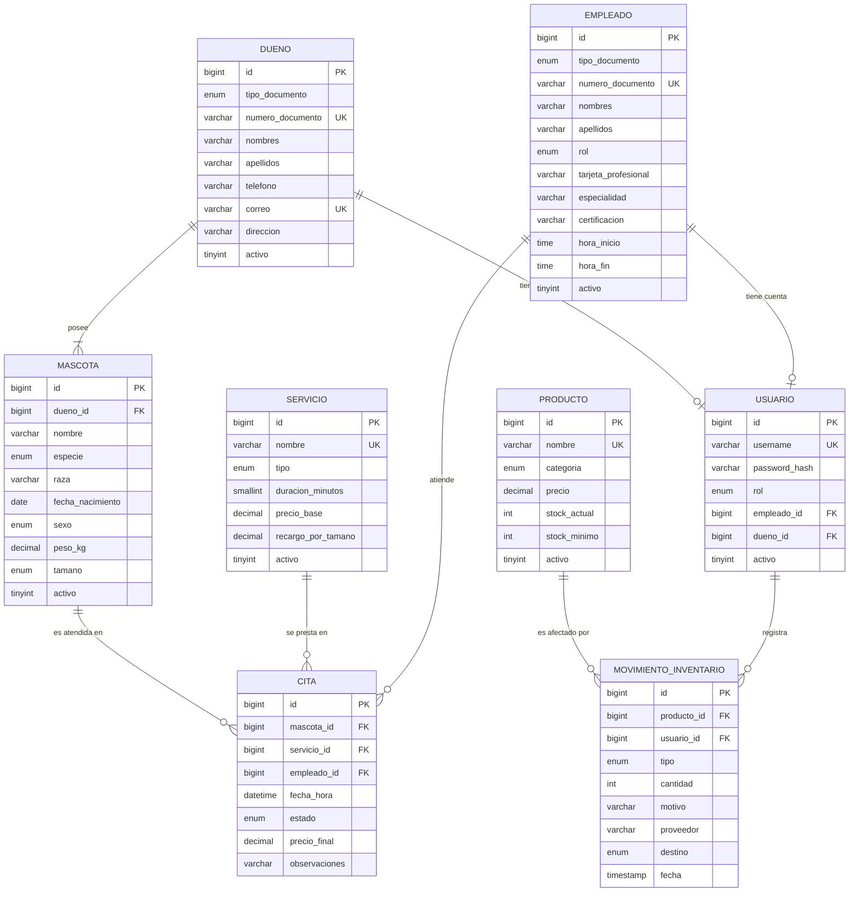

# FASE 2 — MODELO ENTIDAD-RELACIÓN, SCRIPTS MySQL Y CASOS DE USO
## Sistema de Gestión Integral "VetCare" — Veterinaria y Spa de Mascotas

**Programa:** Tecnología en Análisis y Desarrollo de Software (ADSO) — SENA
**Fase:** 2 — Diseño de datos y especificación de casos de uso
**Fecha:** Agosto de 2026
**Versión:** 1.0
**Anexo:** `vetcare_bd.sql` (script ejecutable y verificado)

---

## TABLA DE CONTENIDO

1. Modelo Entidad-Relación
2. Decisiones de diseño del modelo de datos
3. Normalización (1FN, 2FN, 3FN)
4. Diccionario de datos
5. Script MySQL: estructura y evidencia de validación
6. Especificación completa de casos de uso (UC01–UC14)
7. Trazabilidad requisitos ↔ modelo de datos

---

# 1. MODELO ENTIDAD-RELACIÓN

## 1.1 Diagrama E-R (notación crow's foot / Mermaid)



## 1.2 Lectura de cardinalidades (para la sustentación)

| Relación | Cardinalidad | Lectura de negocio |
|----------|--------------|--------------------|
| Dueño — Mascota | 1 : N (obligatoria del lado mascota) | Un dueño posee una o varias mascotas; toda mascota pertenece exactamente a un dueño (RN-03) |
| Mascota — Cita | 1 : N (opcional) | Una mascota puede tener cero o muchas citas; una cita es de exactamente una mascota |
| Servicio — Cita | 1 : N (opcional) | Un servicio puede prestarse en muchas citas |
| Empleado — Cita | 1 : N (opcional) | Un profesional atiende muchas citas; una cita tiene un único profesional asignado |
| Producto — Movimiento | 1 : N (opcional) | Todo movimiento afecta exactamente un producto |
| Usuario — Movimiento | 1 : N (opcional) | Todo movimiento registra su responsable (RNF-10) |
| Empleado/Dueño — Usuario | 1 : 0..1 | Una persona puede o no tener cuenta; una cuenta pertenece a un empleado **o** a un dueño, nunca a ambos (restricción `CHECK` de exclusividad) |

**Nota sobre el historial clínico:** no aparece en el modelo relacional
porque, por decisión de la Fase 1 (sección 4.3), se persiste en MongoDB.
La relación lógica se mantiene mediante el campo `mascotaId` dentro del
documento, referenciando la clave primaria de `mascota` en MySQL. Este es
el punto de integración entre ambas persistencias y debe mencionarse
explícitamente en la sustentación.

---

# 2. DECISIONES DE DISEÑO DEL MODELO DE DATOS

Estas son las decisiones que los instructores probablemente cuestionarán;
cada una tiene su justificación técnica:

## 2.1 Herencia POO → tabla única (Single Table)

Las jerarquías del modelo conceptual (`Empleado → Veterinario/Esteticista`,
`Servicio → Consulta/Spa`, `Movimiento → Entrada/Salida`) se mapean a **una
sola tabla con columna discriminadora** (`rol`, `tipo`, `tipo`
respectivamente), en lugar de una tabla por subtipo (Joined) o por clase
concreta (Table per Class).

**Justificación:** (a) los subtipos difieren en pocos atributos (2–3
columnas), por lo que el costo de columnas `NULL` es mínimo; (b) evita
`JOIN`s en las consultas más frecuentes (agenda, inventario); (c) es la
estrategia por defecto de JPA (`@Inheritance(strategy = SINGLE_TABLE)` con
`@DiscriminatorColumn`), lo que hará directa la implementación en la Fase 3.
La coherencia subtipo-atributo se protege con restricciones `CHECK`
(ej.: `chk_vet_tarjeta` exige tarjeta profesional si `rol='VETERINARIO'`).

## 2.2 Restricción única como defensa parcial de RN-02

`UNIQUE (empleado_id, fecha_hora)` impide que dos citas del mismo
profesional inicien a la misma hora. **No cubre solapamientos por
duración** (una cita de 60 min a las 9:00 se cruza con una a las 9:30):
esa validación requiere lógica de intervalos y se implementa en la capa de
servicio de Spring Boot (Fase 3). Es un ejemplo deliberado de **defensa en
profundidad**: la BD garantiza el caso exacto; la aplicación, el caso
general. Reconocer esta limitación ante los instructores demuestra
comprensión del problema, no debilidad del diseño.

## 2.3 Triggers para la integridad del stock

Los triggers `trg_mov_inventario_before_insert` y `..._after_insert`
garantizan RN-05 y RNF-08 en la propia base de datos: la salida se rechaza
si supera el stock (con `SELECT ... FOR UPDATE` para bloquear la fila y
evitar condiciones de carrera entre dos ventas simultáneas), y el stock se
actualiza automáticamente tras cada movimiento. La capa de servicio
validará lo mismo (mejor mensaje de error al usuario), pero la regla queda
protegida incluso si alguien inserta directamente por SQL.

## 2.4 Borrado lógico, no físico

Todas las entidades maestras usan la columna `activo` (borrado lógico) y
las FK usan `ON DELETE RESTRICT`. Nunca se elimina físicamente un dueño,
mascota o producto con historia asociada: se desactiva. Esto preserva la
trazabilidad (una cita atendida en 2025 debe seguir mostrando qué mascota
y qué servicio involucró) y es el estándar en sistemas de gestión reales.

## 2.5 `precio_final` almacenado en la cita

Aunque el precio puede calcularse desde el servicio, se **materializa** en
la cita al momento de reservar. Razón: si el administrador sube el precio
del servicio mañana, las citas ya reservadas conservan el precio pactado.
Es una desnormalización controlada y justificada por una regla de negocio
temporal, no un error de diseño.

## 2.6 `DECIMAL(10,2)` para dinero

Nunca `FLOAT`/`DOUBLE` para valores monetarios: los flotantes acumulan
errores de redondeo binario. `DECIMAL` almacena el valor exacto. En Java
corresponderá a `BigDecimal`.

---

# 3. NORMALIZACIÓN (1FN, 2FN, 3FN)

El modelo cumple la Tercera Forma Normal. Verificación:

**Primera Forma Normal (1FN):** todos los atributos son atómicos. No hay
grupos repetitivos ni listas embebidas: los teléfonos son un valor único,
las mascotas de un dueño están en su propia tabla (no en una columna
"mascotas" separada por comas), y los movimientos de inventario son filas
individuales, no un campo de texto acumulado.

**Segunda Forma Normal (2FN):** al usar claves primarias sustitutas
(`id AUTO_INCREMENT`) de un solo atributo, no pueden existir dependencias
parciales de la clave. Adicionalmente se verificó la tabla con clave
candidata compuesta (`cita`: empleado_id + fecha_hora es única): ningún
atributo depende solo de una parte de esa clave candidata.

**Tercera Forma Normal (3FN):** no existen dependencias transitivas. El
caso que se analizó y resolvió: en una versión preliminar, `cita` tenía
`nombre_servicio` y `precio_servicio` copiados — eso era una dependencia
transitiva (id_cita → servicio_id → nombre). Se eliminó dejando solo la FK
`servicio_id`. La única copia que permanece es `precio_final`, y no es una
violación de 3FN sino un **hecho histórico** propio de la cita (el precio
pactado en ese momento), distinto del precio vigente del servicio — misma
razón por la que una factura real congela sus precios.

---

# 4. DICCIONARIO DE DATOS

Se documentan las tablas núcleo; el resto sigue el mismo formato en el
script anexo (comentarios `COMMENT` en cada tabla y columna crítica).

## 4.1 Tabla `cita`

| Columna | Tipo | Nulo | Clave | Descripción / Regla |
|---------|------|------|-------|---------------------|
| id | BIGINT UNSIGNED AUTO_INCREMENT | No | PK | Identificador de la reserva |
| mascota_id | BIGINT UNSIGNED | No | FK → mascota | Paciente de la cita |
| servicio_id | BIGINT UNSIGNED | No | FK → servicio | Servicio reservado |
| empleado_id | BIGINT UNSIGNED | No | FK → empleado | Profesional asignado (RN-04 se valida en servicio) |
| fecha_hora | DATETIME | No | UK compuesta con empleado_id | Inicio de la cita (RN-01, RN-02) |
| estado | ENUM(PENDIENTE, CONFIRMADA, ATENDIDA, CANCELADA, NO_ASISTIO) | No | — | Máquina de estados de la Fase 1, sección 3.5 |
| precio_final | DECIMAL(10,2) | Sí | — | Precio pactado (materializado, ver 2.5) |
| observaciones | VARCHAR(255) | Sí | — | Notas de la reserva |

## 4.2 Tabla `producto`

| Columna | Tipo | Nulo | Clave | Descripción / Regla |
|---------|------|------|-------|---------------------|
| id | BIGINT UNSIGNED AUTO_INCREMENT | No | PK | Identificador |
| nombre | VARCHAR(100) | No | UK | Nombre comercial único |
| categoria | ENUM(ALIMENTO, MEDICAMENTO, ACCESORIO, HIGIENE, INSUMO) | No | — | Clasificación del inventario |
| precio | DECIMAL(10,2) | No | — | ≥ 0 (CHECK) |
| stock_actual | INT | No | — | ≥ 0 (CHECK, RNF-08); solo lo modifican los triggers |
| stock_minimo | INT | No | — | Umbral de alerta (RF-13) |
| activo | TINYINT(1) | No | — | Borrado lógico |

## 4.3 Tabla `movimiento_inventario`

| Columna | Tipo | Nulo | Clave | Descripción / Regla |
|---------|------|------|-------|---------------------|
| id | BIGINT UNSIGNED AUTO_INCREMENT | No | PK | Identificador |
| producto_id | BIGINT UNSIGNED | No | FK → producto | Producto afectado |
| usuario_id | BIGINT UNSIGNED | No | FK → usuario | Responsable (RNF-10) |
| tipo | ENUM(ENTRADA, SALIDA) | No | — | Discriminador del subtipo POO |
| cantidad | INT | No | — | > 0 (CHECK); salida ≤ stock (trigger, RN-05) |
| motivo | VARCHAR(150) | No | — | Justificación del movimiento |
| proveedor | VARCHAR(100) | Sí | — | Solo aplica a ENTRADA |
| destino | ENUM(VENTA, CONSUMO_INTERNO, BAJA) | Sí | — | Obligatorio si tipo = SALIDA (CHECK) |
| fecha | TIMESTAMP | No | — | Momento del registro |

## 4.4 Tabla `usuario`

| Columna | Tipo | Nulo | Clave | Descripción / Regla |
|---------|------|------|-------|---------------------|
| id | BIGINT UNSIGNED AUTO_INCREMENT | No | PK | Identificador |
| username | VARCHAR(60) | No | UK | Nombre de acceso |
| password_hash | VARCHAR(100) | No | — | Hash BCrypt, nunca texto plano (RNF-03) |
| rol | ENUM(ADMIN, RECEPCION, VETERINARIO, ESTETICISTA, CLIENTE) | No | — | Autorización (RF-14, RNF-04) |
| empleado_id | BIGINT UNSIGNED | Sí | FK → empleado | Vínculo si es personal |
| dueno_id | BIGINT UNSIGNED | Sí | FK → dueno | Vínculo si es cliente |
| — | — | — | CHECK | Exclusividad: exactamente uno de los dos vínculos no nulo |

---

# 5. SCRIPT MySQL: ESTRUCTURA Y EVIDENCIA DE VALIDACIÓN

## 5.1 Estructura del script anexo `vetcare_bd.sql`

1. Creación del esquema `vetcare_db` (utf8mb4, InnoDB).
2. Tablas maestras sin dependencias: `dueno`, `empleado`, `servicio`, `producto`.
3. Tablas dependientes: `mascota`, `usuario`, `cita`, `movimiento_inventario`.
4. Triggers de integridad del stock (RN-05, RNF-08).
5. Vistas: `v_productos_stock_bajo` (RF-13), `v_agenda_dia` (RF-08), `v_servicios_mas_solicitados` (RF-19).
6. Datos semilla realistas (3 dueños, 5 empleados, 6 servicios, 6 productos, 4 mascotas, movimientos y citas).
7. Consultas de verificación listas para usar en la sustentación.

## 5.2 Evidencia de validación (ejecución real del script)

El script fue ejecutado de principio a fin en un motor MariaDB 10.11
(compatible MySQL) con los siguientes resultados verificados:

**a) Ejecución completa sin errores** (`exit=0`).

**b) Los triggers calculan el stock correctamente.** El stock inicial de
todos los productos es 0; tras insertar los movimientos semilla, el stock
resultante coincide con entradas − salidas:

```
Antipulgas pipeta:       ENTRADA 30 − SALIDA 2 = 28  ✓
Shampoo medicado 500ml:  ENTRADA  8 − SALIDA 1 =  7  ✓
```

**c) Prueba negativa de RN-05** — intentar una salida de 999 unidades con
stock 5 es rechazada por el trigger:

```
ERROR 1644 (45000): RN-05: la salida supera el stock disponible
```

**d) Prueba negativa de RN-02 (defensa parcial)** — intentar registrar una
segunda cita para el mismo profesional a la misma hora es rechazada:

```
ERROR 1062 (23000): Duplicate entry '3-2026-08-14 09:00:00'
for key 'uk_cita_empleado_horario'
```

**e) Nota de compatibilidad:** durante la validación se detectó que las FK
de la tabla `usuario` no pueden usar `ON UPDATE CASCADE` cuando sus
columnas participan en una restricción `CHECK` (limitación de MariaDB;
MySQL 8 lo permite). Se ajustaron a `RESTRICT`, que además es más correcto
semánticamente: no debe eliminarse un empleado o dueño con cuenta activa.
Documentar este hallazgo evidencia un proceso real de prueba del script.

---

# 6. ESPECIFICACIÓN COMPLETA DE CASOS DE USO

Formato: los casos de uso **críticos** (UC02, UC04, UC06, UC08, UC12,
UC14) se especifican en formato extendido; los restantes, en formato
compacto. UC04 fue especificado en la Fase 1 (sección 3.3) y no se repite.

## 6.1 Índice de casos de uso

| Código | Nombre | Actores | Prioridad | RF asociados |
|--------|--------|---------|-----------|--------------|
| UC01 | Registrarse / Iniciar sesión | Todos | Alta | RF-01, RF-14 |
| UC02 | Registrar mascota | Cliente, Recepcionista | Alta | RF-02 |
| UC03 | Consultar disponibilidad | Cliente | Alta | RF-05 |
| UC04 | Reservar cita | Cliente, Recepcionista | Alta | RF-06 (ver Fase 1, §3.3) |
| UC05 | Cancelar cita | Cliente | Media | RF-20 |
| UC06 | Gestionar citas | Recepcionista | Alta | RF-07, RF-18 |
| UC07 | Consultar agenda | Veterinario, Esteticista | Alta | RF-08 |
| UC08 | Registrar atención clínica | Veterinario | Alta | RF-09 |
| UC09 | Consultar historial clínico | Veterinario | Alta | RF-10 |
| UC10 | Gestionar servicios | Administrador | Alta | RF-04 |
| UC11 | Gestionar productos | Administrador | Alta | RF-11, RF-13 |
| UC12 | Registrar movimiento de inventario | Admin, Recepción | Alta | RF-12 |
| UC13 | Generar reportes | Administrador | Media | RF-19 |
| UC14 | Gestionar empleados y roles | Administrador | Alta | RF-14 |

## 6.2 UC01 — Registrarse / Iniciar sesión (compacto)

**Actores:** todos. **Precondición:** ninguna (registro) / cuenta activa (login).
**Flujo esencial:** (registro de cliente) el visitante diligencia sus datos
personales (crea `dueno`) y credenciales (crea `usuario` rol CLIENTE con
contraseña cifrada BCrypt); (login) el usuario ingresa credenciales, el
sistema valida el hash y emite un token JWT con el rol.
**Alternos:** correo o documento ya registrado → informar y ofrecer
recuperación; credenciales inválidas → mensaje genérico "usuario o
contraseña incorrectos" (no revelar cuál falló, buena práctica de seguridad).
**Postcondición:** sesión iniciada con permisos según rol (RNF-04).
**Nota:** las cuentas del personal las crea el administrador (UC14), no hay
autorregistro de empleados.

## 6.3 UC02 — Registrar mascota (extendido)

| Elemento | Descripción |
|----------|-------------|
| **Actores** | Cliente (desde web/móvil), Recepcionista (presencial) |
| **Precondiciones** | Actor autenticado; existe el dueño (el propio cliente, o buscado por la recepcionista) |
| **Postcondiciones** | Mascota creada, activa y asociada al dueño (RN-03) |
| **Requisitos** | RF-02; tabla `mascota` |

**Flujo principal:**

1. El actor selecciona "Agregar mascota".
2. El sistema solicita: nombre, especie, raza (opcional), fecha de nacimiento (opcional), sexo, peso (opcional) y tamaño.
3. El actor diligencia y confirma.
4. El sistema valida los datos (peso > 0 si se ingresa; especie dentro del catálogo).
5. El sistema crea la mascota asociada al dueño y la muestra en el listado.

**Flujos alternos:**
- **4a.** Datos inválidos: el sistema señala el campo y permite corregir.
- **1a.** (Recepcionista) El dueño no existe aún: se ejecuta primero el registro de dueño (RF-01) y se retorna al paso 1.

**Excepciones:** **E1.** Error de persistencia: el sistema informa sin perder los datos diligenciados en el formulario.

## 6.4 UC03 — Consultar disponibilidad (compacto)

**Actor:** Cliente (también invocado por UC04 vía `<<include>>`).
**Flujo esencial:** el actor indica servicio y fecha; el sistema (servicio
PHP) calcula los bloques horarios libres: genera los intervalos de la
jornada (RN-01) según la duración del servicio, resta los ocupados por
citas PENDIENTE/CONFIRMADA de los profesionales aptos (RN-04) y retorna la
lista JSON.
**Alterno:** sin horarios libres → retornar lista vacía y sugerir fechas cercanas.
**Excepción:** servicio PHP caído → el frontend degrada con mensaje de contacto telefónico (Fase 1, §3.3-E1).

## 6.5 UC05 — Cancelar cita (compacto)

**Actor:** Cliente. **Precondición:** cita propia en estado PENDIENTE o CONFIRMADA.
**Flujo esencial:** el cliente selecciona la cita, el sistema verifica la
antelación mínima configurada (RF-20) y la transición válida
(PENDIENTE/CONFIRMADA → CANCELADA, según diagrama de estados), registra la
cancelación y notifica (RF-18).
**Alterno:** antelación insuficiente → informar que debe cancelar por teléfono.
**Regla clave:** RN-06 — una cita ATENDIDA o ya CANCELADA no admite cambios.

## 6.6 UC06 — Gestionar citas (extendido)

| Elemento | Descripción |
|----------|-------------|
| **Actor** | Recepcionista |
| **Precondiciones** | Autenticado con rol RECEPCION o ADMIN |
| **Postcondiciones** | Estado de la cita actualizado conforme a la máquina de estados |
| **Requisitos** | RF-07, RF-18; RN-02, RN-06 |

**Flujo principal (confirmar):**

1. La recepcionista consulta las citas PENDIENTES del día o rango.
2. Selecciona una cita y la acción "Confirmar".
3. El sistema valida la transición (PENDIENTE → CONFIRMADA) y que el horario del profesional siga libre.
4. El sistema actualiza el estado y dispara la notificación al cliente (RF-18).

**Flujos alternos:**
- **Reprogramar:** equivale a cancelar la cita actual y crear una nueva (reutiliza UC04); se registra la observación del cambio.
- **Marcar inasistencia:** CONFIRMADA → NO_ASISTIO cuando el cliente no llega (habilita estadísticas de inasistencia para RF-19).
- **3a.** Transición inválida (p. ej. confirmar una CANCELADA): el sistema la rechaza con mensaje de la regla RN-06.

## 6.7 UC07 — Consultar agenda (compacto)

**Actores:** Veterinario, Esteticista.
**Flujo esencial:** el profesional autenticado consulta su agenda diaria o
semanal; el sistema retorna sus citas (vista `v_agenda_dia` filtrada por
su `empleado_id`) con mascota, servicio, hora y datos de contacto del dueño.
**Regla:** cada profesional solo ve su propia agenda; el ADMIN ve todas.

## 6.8 UC08 — Registrar atención clínica (extendido)

| Elemento | Descripción |
|----------|-------------|
| **Actor** | Veterinario |
| **Precondiciones** | Cita en estado CONFIRMADA asignada al veterinario; rol VETERINARIO (RN-07) |
| **Postcondiciones** | Documento de historial creado en MongoDB; cita en estado ATENDIDA |
| **Requisitos** | RF-09; colección `historial_clinico` |

**Flujo principal:**

1. El veterinario abre la cita del día desde su agenda (UC07).
2. El sistema muestra los datos de la mascota y el acceso a su historial (UC09, `<<extend>>`).
3. El veterinario registra: motivo, diagnóstico, tratamiento, vacunas aplicadas (lista) y observaciones.
4. El sistema guarda el documento en MongoDB con `mascotaId`, `veterinarioId`, `citaId` y fecha.
5. El sistema cambia la cita a ATENDIDA (transición CONFIRMADA → ATENDIDA).

**Flujos alternos:**
- **3a.** Atención sin diagnóstico definitivo: el campo diagnóstico admite "pendiente de resultados" y el documento puede complementarse después (solo por el mismo veterinario o el ADMIN).

**Excepciones:** **E1.** MongoDB no disponible: la atención se registra temporalmente en el campo observaciones de la cita (MySQL) y se marca para migración manual — degradación documentada, no pérdida de datos.

## 6.9 UC09 — Consultar historial clínico (compacto)

**Actor:** Veterinario.
**Flujo esencial:** el veterinario busca la mascota; el sistema consulta la
colección `historial_clinico` por `mascotaId` y muestra las atenciones en
orden cronológico descendente, con vacunas y tratamientos anidados.
**Regla:** RN-07 — solo roles VETERINARIO y ADMIN acceden al historial; el
cliente ve un resumen (vacunas y próximas dosis) desde la app móvil.

## 6.10 UC10 — Gestionar servicios (compacto)

**Actor:** Administrador.
**Flujo esencial:** CRUD del catálogo de servicios: crear (nombre único,
tipo CONSULTA/SPA, duración 10–240 min, precio ≥ 0, recargo por tamaño si
es SPA), editar y desactivar (borrado lógico; los servicios con citas
históricas nunca se eliminan físicamente).
**Regla derivada:** cambiar el precio no altera citas ya reservadas
(decisión de diseño 2.5).

## 6.11 UC11 — Gestionar productos (compacto)

**Actor:** Administrador.
**Flujo esencial:** CRUD de productos con nombre único, categoría, precio
y stock mínimo. El stock **actual no es editable directamente**: solo
cambia mediante movimientos (UC12) — esta restricción es la clave de la
trazabilidad del inventario. El listado resalta los productos de
`v_productos_stock_bajo` (RF-13).

## 6.12 UC12 — Registrar movimiento de inventario (extendido)

| Elemento | Descripción |
|----------|-------------|
| **Actores** | Administrador, Recepcionista (también desde la app móvil, RF-17) |
| **Precondiciones** | Producto activo; usuario autenticado con rol autorizado |
| **Postcondiciones** | Movimiento registrado con responsable y stock actualizado |
| **Requisitos** | RF-12; RN-05, RNF-08, RNF-10 |

**Flujo principal (salida por venta):**

1. El actor selecciona el producto y la acción "Registrar salida".
2. El sistema muestra el stock disponible.
3. El actor ingresa cantidad, motivo y destino (VENTA / CONSUMO_INTERNO / BAJA).
4. El sistema valida cantidad > 0 y cantidad ≤ stock disponible (RN-05).
5. El sistema registra el movimiento con el `usuario_id` del actor (RNF-10) y el stock se actualiza (trigger).
6. El sistema muestra el nuevo stock y alerta si quedó en o bajo el mínimo (RF-13).

**Flujos alternos:**
- **Entrada:** en el paso 3 se ingresa proveedor en lugar de destino; el paso 4 solo valida cantidad > 0.
- **4a.** Cantidad supera el stock: el sistema rechaza con el mensaje de RN-05 y mantiene el formulario.

**Excepciones:** **E1.** Dos salidas simultáneas del mismo producto: el bloqueo de fila (`FOR UPDATE`) del trigger serializa las operaciones; la segunda falla si ya no hay stock — el sistema informa y sugiere reintentar con la cantidad disponible.

## 6.13 UC13 — Generar reportes (compacto)

**Actor:** Administrador.
**Flujo esencial:** el administrador selecciona el tipo de reporte y el
rango de fechas: (a) citas por período y estado, incluyendo tasa de
inasistencia; (b) servicios más solicitados (`v_servicios_mas_solicitados`);
(c) movimientos de inventario por producto o categoría. El sistema muestra
el resultado en tabla y gráfico, con opción de exportar.

## 6.14 UC14 — Gestionar empleados y roles (extendido)

| Elemento | Descripción |
|----------|-------------|
| **Actor** | Administrador |
| **Precondiciones** | Rol ADMIN |
| **Postcondiciones** | Empleado y su cuenta creados/actualizados con el rol correcto |
| **Requisitos** | RF-14; RN-04; tabla `empleado` + `usuario` |

**Flujo principal:**

1. El administrador registra el empleado: datos personales, rol y jornada (hora_inicio < hora_fin).
2. Si el rol es VETERINARIO, el sistema exige tarjeta profesional (`chk_vet_tarjeta`); si es ESTETICISTA, solicita certificación.
3. El administrador crea la cuenta de acceso (username único, contraseña temporal que el empleado cambia al primer ingreso).
4. El sistema vincula `usuario.empleado_id` (restricción de exclusividad: sin `dueno_id`).

**Flujos alternos:**
- **Desactivar empleado:** borrado lógico; sus citas futuras PENDIENTES/CONFIRMADAS se listan para reasignación (reutiliza UC06-reprogramar).
- **2a.** Falta la tarjeta profesional: el sistema no permite guardar con rol VETERINARIO.

---

# 7. TRAZABILIDAD REQUISITOS ↔ MODELO DE DATOS

| Requisito / Regla | Elemento del modelo que lo implementa |
|-------------------|----------------------------------------|
| RF-01, RF-02, RF-03 | Tablas `dueno`, `mascota`; FK con RESTRICT; borrado lógico |
| RF-04 | Tabla `servicio` con tipo, duración y precios; CHECK de rangos |
| RF-06, RF-07 | Tabla `cita` con ENUM de estados y FKs |
| RF-08 | Vista `v_agenda_dia` |
| RF-11 | Tabla `producto` con CHECK de precio y stock |
| RF-12 | Tabla `movimiento_inventario` + triggers |
| RF-13 | Vista `v_productos_stock_bajo` |
| RF-14 | Tabla `usuario` (hash BCrypt, ENUM de roles, exclusividad empleado/dueño) |
| RF-19 | Vista `v_servicios_mas_solicitados` + consultas de verificación |
| RN-02 | `UNIQUE(empleado_id, fecha_hora)` (parcial) + capa de servicio (Fase 3) |
| RN-08 | Capa de servicio (agregada en la Fase 5; ver anexo de hallazgos) |
| RN-09 | Columna `servicio.duracion_minutos` + script `ajuste_duraciones.sql` |
| RN-03 | FK `mascota.dueno_id NOT NULL` con RESTRICT |
| RN-05 | Trigger BEFORE INSERT con `SIGNAL` y `FOR UPDATE` |
| RN-06 | ENUM de estados; transiciones controladas en servicio (Fase 3) |
| RNF-03 | Columna `password_hash` (BCrypt) |
| RNF-08 | CHECK `stock_actual >= 0` + trigger |
| RNF-10 | FK `movimiento_inventario.usuario_id NOT NULL` |

**Pendientes que asume la Fase 3 (backend):** validación de solapamiento
por duración (RN-02 completo), compatibilidad rol-servicio (RN-04),
horario de atención parametrizable (RN-01) y transiciones de estado
(RN-06) — todos en la capa de servicio de Spring Boot, donde pertenecen
las reglas de negocio según la restricción de diseño de la Fase 1 (§6.3).

---

## CONTROL DE VERSIONES DEL DOCUMENTO

| Versión | Fecha | Autor | Cambios |
|---------|-------|-------|---------|
| 1.0 | Agosto 2026 | [Nombre del aprendiz] | Modelo E-R, script validado y casos de uso UC01–UC14 |
| 1.1 | Septiembre 2026 | [Nombre del aprendiz] | Trazabilidad de RN-08 y RN-09 tras las pruebas funcionales |
